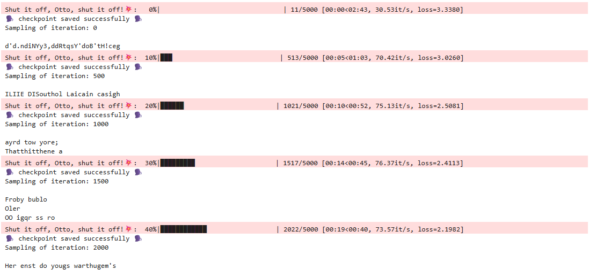
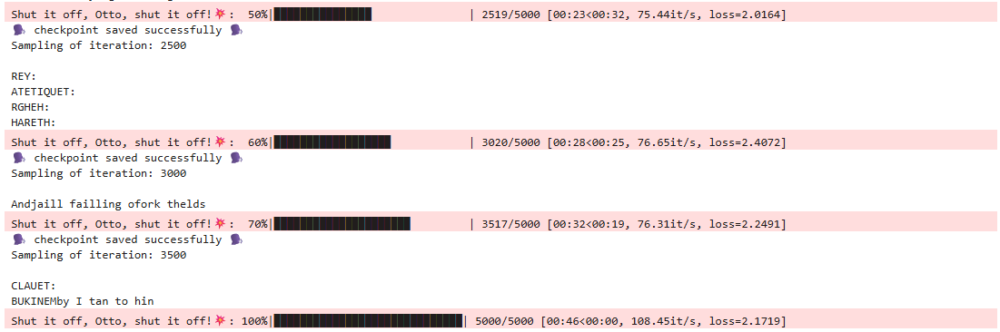
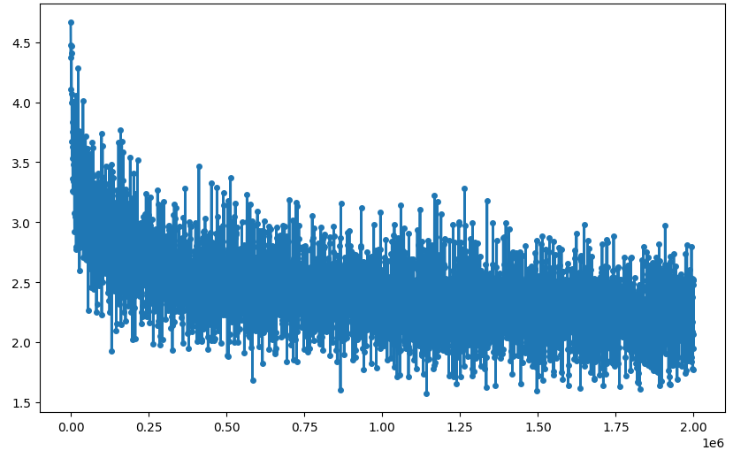
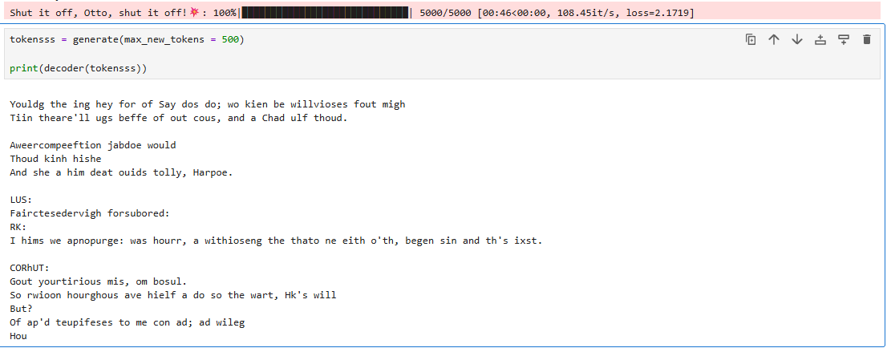
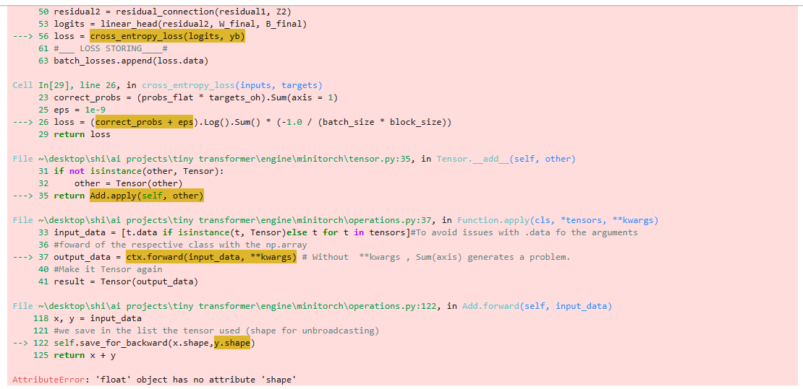
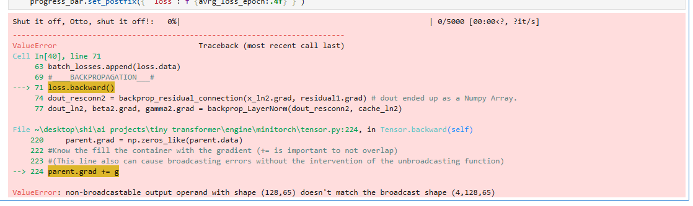

# ⚙️ HYBRID TINY TRANSFORMER ⚙️

## DESCRIPTION

A Hybrid Tiny Transformer trained with the dataset of all Shakespeare.\
**Combining** the use of the automatic gradient descent of my previous project (**Minitorch**) and **manual** back-propagation using **only NumPy** for functions like the **Multi-Head Attention**, **Positional Encoding**, **Layer Norm**, etc.


## WHY?

This project is like a "final exam" for me. Previously I made projects like the **Minitorch** which has achieved a parity with PyTorch of 1e-6 Atol and this is a good way of challenging its capacity in a **"real environment"**.Also, I made projects like the **CNN-from scratch**(CIFAR-10) or the **NN-from scratch**(MNIST) so the next logical step is to do the same thing but now with a more advanced architecture like the Transformer.\
As a project, the final objective isn't that it becomes a "bard" but the decreasing of the loss and the acquisition of complete control of the architecture.

>[!NOTE]
>That is the reason why it is a Hybrid Tiny Transformer, because I'll use the minitorch for the parts that I already know, like the FFN (I've learned it in the NN of MNIST), and the rest of the parts that are new to me (like the Multi-Head Attention and its Back Propagation) will be written using only NumPy.

## SAMPLINGS & METRICS

The Model has been trained for **46 seconds** with a total of **5000** iterations reaching a peak velocity of **108.45 iterations per second**.\
In the following images you can see the progress of the training of the model at the same time as the sampling of each checkpoint saved, letting you see the quality of the predictions and how they get better through the training. 



*First screenshot of the output cell of the training function*



*Second screenshot of the output cell of the training function*


In the time training, the loss has decreased from an entropy of **4.5** (total chaos) to a loss close to **2.1**, showing clear signs of improvement.\
The graph shows a noisy training (because of the difference of the batches) but with an overall tendency to decrease.


*Raw loss curve showing a decrease in the loss of the model*


In the next image the number of tokens generated is expanded, from a previous 30 tokens(checkpoint samplings) to a 500 tokens generation to show its ability to generate longer text after the training.


*Text showcasing the model trying to predict the correct next token after the training*


## FEATURES

- Hybrid Architecture with a Custom Engine.
- Manual Back-Propagation.
- High-Efficiency Training(**CPU Only**).
- Memory-Lean Design.
- Learned-Positional Encoding.
- Checkpoint System.
- Numerical Stability.
- Automated Data Pipeline.


## ARCHITECTURE 🔶

The **Hybrid Tiny Transformer** implements an architecture that splits the data flow and the responsibilities between an autograd engine and manual mathematical operations.

### 1. The Hybrid Engine  

#### Minitorch(Autograd Engine): 
- Manages the Dense Layers(**FFN**) and gradient computation for all the trainables weights.
#### Manual Numpy Ops
- Implements the **Multi-Head Attention** and **LayerNorm** logic. The backpropagation for these components was derived and implemented from scratch.

### 2. Block Diagram & Data Flow

#### Token & Positional Encoding: 
- Tokens are projected into vector and fused with a learned parameter to encode sequence order.
#### Transformer Block:
- **Layer Norm**(Manual): Normalize activations to stabilize the training process.
- **Multi-Head Attention**(Manual): Compute the relevance of different tokens in the context window.
- **Layer Norm**(Manual): Another Layer Norm because I wanted to see what happens if I use two and test it.
- **Feed-Foward Network**(Minitorch): Processes the second layer norm output through non-linear transformations.
#### Cross Entropy Loss:
- Use of a **Custom Loss Function** to be able to process the inputs in NumPy Tensors(if the model isn't training) and the inputs in Minitorch's Tensors(if the model is in training phase).

### 3. Hyperparameters 
- **Batch size**: 4
- **Block Size & Context Windows**: 8
- **Number of Embeddings**: 128
- **Number of Heads**: 4
- **Vocabulary Size**: ~65 Characters (Tiny Shakespeare)
- **Optimizer**: Adam (integrated within the MiniTorch Engine)

>[!NOTE]
> Unlike standard black-boxes the **Scaled Dot-Product** and the **Causal Triangular Mask** were implemented bit-by-bit in NumPy.Preventing the model to be able to cheat seeing future tokens.


## PROBLEMS & SOLUTIONS

>[!NOTE]
>During the development of the project I encountered many problems(especially in the test phase),the commented cells inside are just for explanation of the code,this section focuses in the opposite,the journey to reach those solutions.(**You can skip it if you're not interested,is mostly "personal"**).

### THEORY PROBLEMS

The architecture of the transformer (at least the one of the original paper "Attention is all you need")was a lil bit complex personally, leading me to choose some options that are more contemporaneous for example, the use of the learned positional encoding instead of the positional encoding using the sinusoidal wave which was suggested in the original paper.
Another and probably the most unique problem that I had was the incorporation of the autograd engine in all of its aspects,from the incorporation as a submodule because there were problems with name compatibility (at the beginning I named the submodule as "minitorch" which brought me incompatibilities with the inside route due to the nested names "minitorch/minitorch/minitorch...") and then other problems like broadcasting where the tensor had a different number of dimensions than expected.
The last real "problem" that I wanna talk about is the Layer Norm.Personally, I found the layer norm and its back-propagation especially harder than anything else combined in the transformer (I'm still learning it after finishing the hybrid tiny transformer to get it at 10000%),it is because of the standard deviation and the mean which to get the gamma and beta in the backprop is pretty simple but where the trouble is, is in the derivative of the input(that gives me nightmares) because of the amount of transformations needed to undo the mean and standard deviation which is needed to keep backproping.


-As I mentioned previously the solution to the problem of the sinusoidal wave was just don't use it (in the future I'm planning to use and learn it at the same time).Then when it comes to the problem of the names the solution after a long time trying to figure out where was the problem was just simply start all over again but instead of naming the submodule as "minitorch" I named it as "Engine" which resolved the problem and gave me mental peace (for at least an hour), for that reason if you wanna try the project I've set the git clone with the -recursive and the submodule name engine already so you don't have the same problem.
Lastly, as I have already told you the problem of the derivative of the input of the backprop of the layer norm is still there (it doesn't mean that I can't do it because now I know the necessity and the functionality of the layer norm,it's just the mathematical part that seems like a memory puzzle).


### CODING PROBLEMS

Here come the expected problems.Ignoring the name problem because I feel like that is more like something theoretical rather than an actual code problem, the majority of the problems in respect to the minitorch and its incorporation were broadcasting errors.

For example this problem I remember was an error when I was getting the shape of the tensor for the backpropagation where it gave me a scalar number instead of a tuple with that scalar.

*Problems of unsaved shape using the NumPy ".shape"*


Or this other problem where the broadcasting problem was inside the .backward() of the Tensor.py of the Minitorch.

*Broadcasting problems inside the backward function of the autograd engine*


Surprisingly there weren't too many errors in the declaration of the functions in the manual part,but then when I needed to use the function that I did manually to use it with minitorch there is when the issues arose, for example the cross entropy loss function, originally was just a function for the autograd but then when I needed it for the estimate loss function I couldn't use it and you may think "why don't you just use the .data of the minitorch's tensors and make the cross entropy loss function only work with NumPy arrays so it would work for both scenarios?", but the problem there is that inside the cross entropy loss funtion I've been using the special functions that the minitorch tensors have which a regular NumPy arrays can't use.
Then the rest of the coding errors were just typos,a lot of typos.

The solution for the majority of the problems was simple due to the help of the output cell of the jupyter notebook with its traceback just read and go to there and change one or two minor things,when the things were inside the minitorch the problems were more complex due to the actualization of the submodule and checking if the changes worked,so I usually had both of the projects open to iterate faster.The problems with Cross Entropy Loss function was just re-write the cell all over again but with an if statement to identify if it is a Tensor of Minitorch or a NumPy Tensor using different functions and managing the different data.The problem of the shape with Numpy at first I was quite confused because I didn't know the difference between doing x.shape and np.shape(x), once I learned that I solved it by changing x.shape for np.shape(x) inside the minitorch and updating the submodule inside the transformer.
And finally with the typos..I HATE typos.


## HOW TO RUN

>[!NOTE]
> The Setup uses another repository so you will need more than just a simple "git clone", follow this steps to set up the environment and run the Transformer in your local machine.


### 1. CLONE REPOSITORY

Since the repository uses **MiniTorch** as a Submodule,you most clone it recursively:

```bash

git clone --recursive https://github.com/NvirAdan/Hybrid-Tiny-Transformer.git

```
Enter the Folder:

```bash

cd "Hybrid-Tiny-Transformer"

```

### 2. CREATE A VIRTUAL ENVIRONMENT AND ACTIVATE IT (RECOMMENDED)

Create the Virtual Environment:

```bash

python -m venv venv

```

If you use **WINDOWS**:

```bash

.\venv\scripts\activate

```

If you use **LINUX**:

```bash

source venv/bin/activate

```

### 3. Install Dependencies

```bash

pip install -r requirements.txt

```

### 4. Run All The Cells